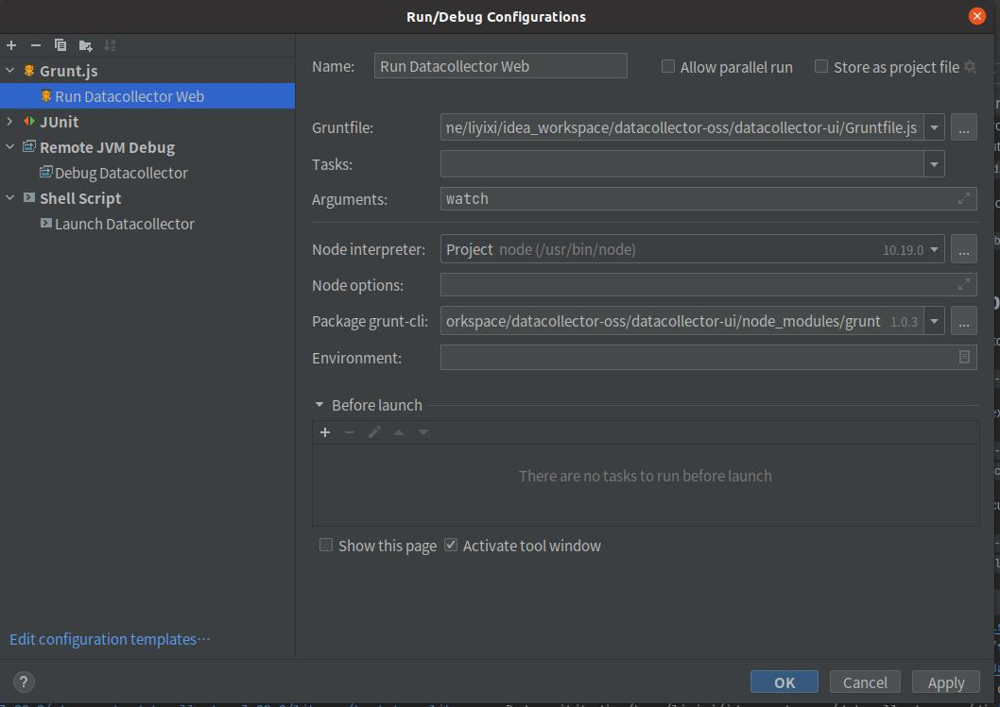
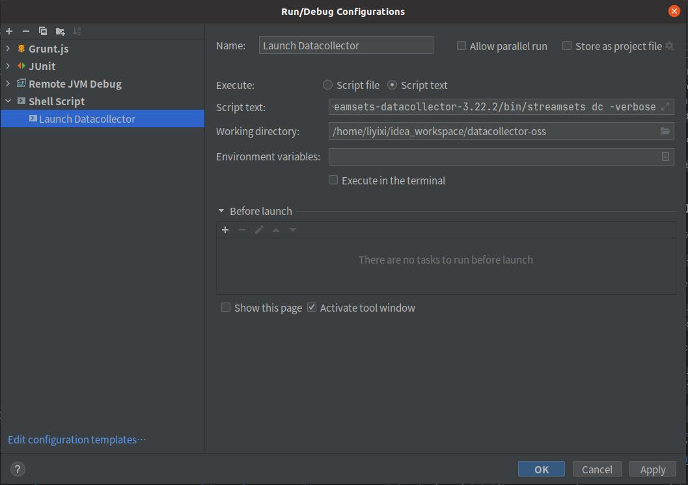
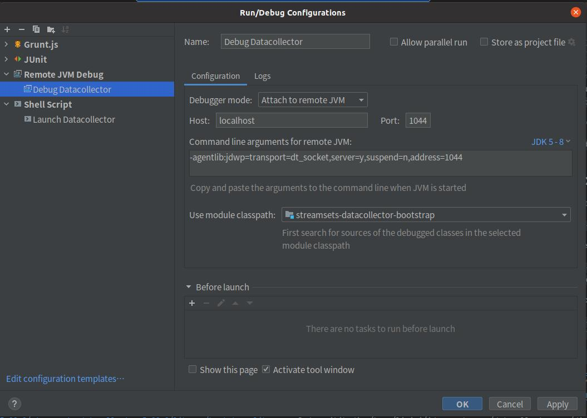
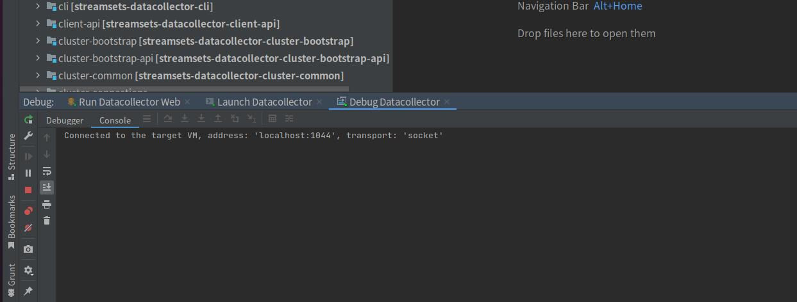

# 构建 StreamSets Data Collector 参考

# 开发环境依赖准备 :
- OS  Ubuntu 20.04.3 LTS (GNU/Linux 5.11.0-44-generic x86_64)
- Git 2.25.1
- Oracle JDK 1.8.0_181(Compile) OpenJDK 11.0.10(Runtime)
- Maven 3.8.3
- Node 10.19.0  (macOS, `brew install nodejs`       : Linux, [nodejs.org](https://nodejs.org) or [Packages from NodeSource](https://github.com/nodesource/distributions))
- npm 6.14.4   (macOS, `brew install nodejs`       : Linux, [nodejs.org](https://nodejs.org) or [Packages from NodeSource](https://github.com/nodesource/distributions))
- bower    (macOS, `npm -g install bower`      : Linux, `sudo npm -g install bower`)
- grunt-cli      (macOS, `npm -g install grunt-cli`  : Linux, `sudo npm -g install grunt-cli`)

## 环境变量

    # export JAVA_HOME=/home/liyixi/java/java11
    export JAVA_HOME=/home/liyixi/java/jdk1.8.0_181
    export CLASSPATH=.:$JAVA_HOME/lib
    export PATH=$JAVA_HOME/bin:$PATH

    export M2_HOME=/home/liyixi/apache-maven-3.8.3
    export MAVEN_HOME=/home/liyixi/apache-maven-3.8.3
    # export PATH=$MAVEN_HOME/bin:$PATH:/home/liyixi/idea2021.3/idea-IU-213.5744.223/bin

JDK环境变量配置可以参考官方部分。[Click here for details](BUILD.md)

## 前置项目构建

- 下载最新的源码

  `git clone http://192.168.16.193/dev3/support/streamsets/datacollector-api-oss.git`

  `git clone http://192.168.16.193/dev3/support/streamsets/datacollector-plugin-api-oss.git`

- 安装到本地 Maven 库

  `mvn clean install -DskipTests`

### datacollector-edge

datacollector-edage 项目为可选编译，若实际使用中需要使用datacollector的Edge Pipeline，则需要构建edge模块

- 下载最新的datacollector-edge源码

  `git clone http://192.168.16.193/dev3/support/streamsets/datacollector-edge-oss.git`

- 安装到本地 Maven 库:

  `./gradlew goClean dist publishToMavenLocal`

## 构建 Streamsets-datacollector

下载源码

`git clone http://192.168.16.193/dev3/support/streamsets/streamsets-collector.git`

### 构建前端Web

- 尝试安装 datacollector-ui

  进入datacollector-ui目录，执行 `mvn install -DskipTests`

- Bower下载依赖失败临时解决办法

  进入datacollector-ui-dependence目录，将src/main/resources/bower_components.zip解压至datacollector-ui/target 目录下

- 构建前端文档结构

进入datacollector-ui目录，执行`grunt watch`

or

使用 Idea Run/Debug Configuration(Grunt.Js)

最后，通过环境变量**SDC_JAVA_OPT**指定前端Web目录，如下

    export SDC_JAVA_OPTS="-Dsdc.static-web.dir={ROOT目录}/datacollector-ui/target/dist ${SDC_JAVA_OPTS}"

### 核心datacollector构建

进入streamsets-collector工程目录执行:

`mvn install -Pdist -DskipTests`

运行 streamsets-collector:

`dist/target/streamsets-datacollector-3.22.2/streamsets-datacollector-3.22.2/bin/streamsets dc`

or

使用 Idea Run/Debug Configuration(Shell Script)，参考如下：

### 服务Debug

- 打开调试配置

  修改 {ROOT}/dist/target/streamsets-datacollector-3.22.2/streamsets-datacollector-3.22.2/bin/libexec/sdc-env.sh 文件，增加如下内容

    export SDC_JAVA_OPTS="-agentlib:jdwp=transport=dt_socket,server=y,suspend=n,address=1044 ${SDC_JAVA_OPTS}"

- 连接调试

  使用Idea Run/Debug Configuration(Remote Debug),参考如下：

最终服务启动效果如图：

## 打包发布

在项目Root目录执行:

`mvn clean package -Drelease -DskipTests`
